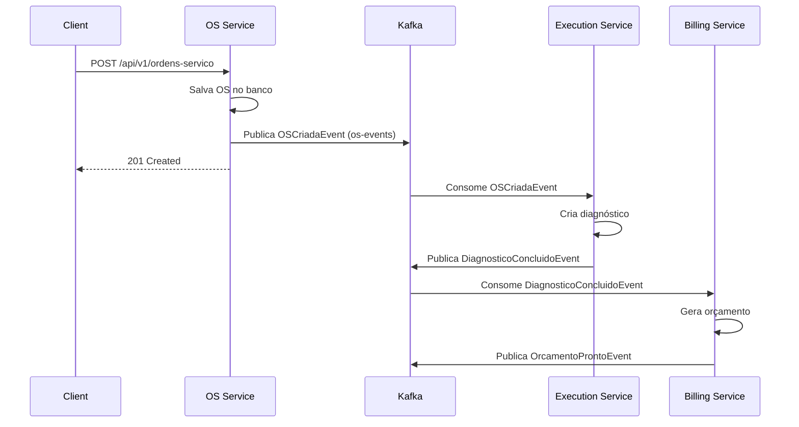
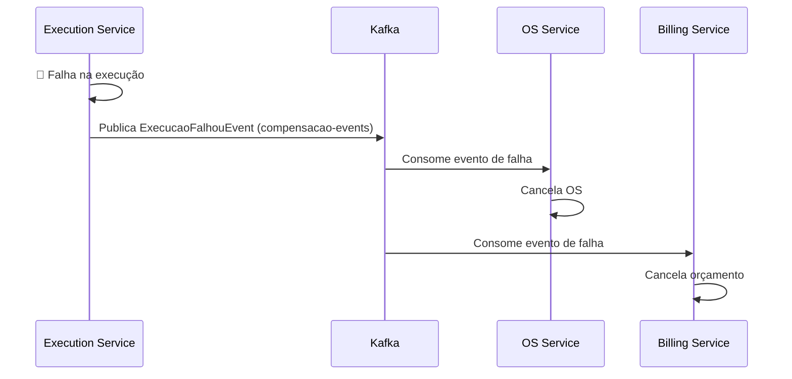

# 🚀 Quick Start - Arquitetura Tech Challenge

## 📖 Para Novos Desenvolvedores

**Bem-vindo!** Este guia serve como ponto de partida para entender a arquitetura do sistema.

---

## 🎯 Entenda em 5 Minutos

### O que é o sistema?
Sistema de **gestão de oficina mecânica** com 10 microserviços independentes rodando em Kubernetes (AWS EKS).

### Stack Tecnológica
- **Backend:** Java 21 + Spring Boot 3.3.13
- **Mensageria:** Apache Kafka 3.7.2
- **Bancos:** PostgreSQL 16.3 (9x) + MongoDB (1x)
- **Cloud:** AWS (EKS, RDS, DocumentDB, Lambda)
- **IaC:** Terraform
- **Observabilidade:** New Relic

### Arquitetura em 3 camadas
```
┌────────────────────────────────────────┐
│  API Gateway (ALB + Ingress)          │
└───────────────────┬────────────────────┘
                    │
         ┌──────────▼──────────┐
         │  10 Microserviços    │
         │  (Kubernetes EKS)    │
         └──────────┬───────────┘
                    │
     ┌──────────────┼──────────────┐
     │              │              │
┌────▼─────┐  ┌────▼────┐   ┌────▼─────┐
│PostgreSQL│  │ MongoDB │   │  Kafka   │
│  (9x)    │  │  (1x)   │   │ Topics   │
└──────────┘  └─────────┘   └──────────┘
```

---

## 🏗️ Os 10 Microserviços

### Grupo 1: APIs Principais com Saga (Kafka)

| Serviço | O que faz | Eventos | Banco |
|---------|-----------|---------|-------|
| [OS Service](../tech_fiap3/src/main/java/br/com/grupo99/os/) | Gerencia ordens de serviço | Publica: `OSCriadaEvent`, `StatusMudadoEvent` | PostgreSQL |
| [Execution Service](../tech_fiap3/src/main/java/br/com/grupo99/execution/) | Diagnósticos e execução | Publica: `DiagnosticoConcluidoEvent` <br/> Consome: `OSCriadaEvent` | PostgreSQL |
| [Billing Service](../tech_fiap3/src/main/java/br/com/grupo99/billing/) | Orçamentos e pagamentos | Publica: `OrcamentoProntoEvent` <br/> Consome: `OSCriadaEvent`, `DiagnosticoConcluidoEvent` | **MongoDB** |

**Características:**
- ✅ Circuit Breaker (Resilience4j)
- ✅ Retry Pattern (exponential backoff)
- ✅ Kafka Event-Driven
- ✅ Saga Pattern Coreografada

### Grupo 2: APIs CRUD (Apenas HTTP)

| Serviço | O que faz | Endpoints |
|---------|-----------|-----------|
| Customer Service | Clientes e veículos | `GET/POST /api/v1/clientes` |
| People Service | Cadastro de pessoas | `GET/POST /api/v1/pessoas` |
| HR Service | Funcionários | `GET/POST /api/v1/funcionarios` |
| Catalog Service | Catálogo de serviços/peças | `GET/POST /api/v1/catalogo` |
| Maintenance Service | Manutenções programadas | `GET/POST /api/v1/manutencoes` |
| Notification Service | Notificações | `GET/POST /api/v1/notificacoes` |
| Operations Service | Operações diárias | `GET/POST /api/v1/operacoes` |

**Características:**
- ❌ Não usam Kafka (apenas REST)
- ❌ Sem Circuit Breaker (operações síncronas simples)
- ✅ Clean Architecture
- ✅ PostgreSQL

---

## 🔄 Como funcionam as Sagas?

### Fluxo de Criação de OS (Happy Path)



**Tópicos Kafka:**
- `os-events` → Eventos de ordens de serviço
- `execution-events` → Eventos de execução
- `billing-events` → Eventos de faturamento
- `compensacao-events` → Rollback (compensação)

### E se algo falhar? (Compensação)



---

## 🛡️ Circuit Breaker (Resilience4j)

### O que é?
Padrão de resiliência que **evita chamadas repetidas a serviços que estão falhando**.

### Estados do Circuit Breaker
```
     CLOSED (Normal)
         │
         │ 50% de falhas
         │ em 10 tentativas
         ▼
      OPEN (Bloqueado)
         │
         │ Aguarda 30s
         ▼
    HALF_OPEN (Teste)
         │
    ┌────┴────┐
    │         │
Sucesso   3 falhas
    │         │
    ▼         ▼
 CLOSED    OPEN
```

### Onde está implementado?
- ✅ OS Service: 4 métodos (publicação Kafka)
- ✅ Execution Service: 3 métodos (publicação Kafka)
- ✅ Billing Service: 4 métodos (publicação Kafka)

### Exemplo de código
```java
@CircuitBreaker(name = "kafkaPublisher", fallbackMethod = "publishEventFallback")
@Retry(name = "kafkaPublisher")
public void publishOSCriada(OSCriadaEvent event) {
    kafkaTemplate.send("os-events", event.getOsId().toString(), event);
}

// Fallback quando Circuit Breaker está OPEN
public void publishEventFallback(OSCriadaEvent event, Throwable t) {
    log.error("🔴 Circuit Breaker ABERTO - Salvando evento para retry", t);
    // Salvar em outbox table para processar depois
}
```

---

## 🗄️ Bancos de Dados

### Por que 2 tipos de banco?

| Serviço | Banco | Razão |
|---------|-------|-------|
| **9 serviços** | PostgreSQL 16.3 | Dados estruturados, relacionamentos complexos, ACID |
| **Billing Service** | MongoDB (DocumentDB) | Schema flexível para orçamentos variáveis |

**Exemplo:**
```json
// Billing Service - Orçamento com schema flexível
{
  "osId": "123",
  "itens": [
    {"tipo": "servico", "descricao": "Troca de óleo", "valor": 50.0},
    {"tipo": "peca", "descricao": "Filtro", "valor": 30.0},
    {"tipo": "desconto", "motivo": "Cliente VIP", "valor": -10.0}
  ],
  "anexos": ["foto1.jpg", "foto2.jpg"],
  "observacoes": "Cliente solicitou peças originais"
}
```

### Database per Service Pattern
✅ Cada microserviço tem **seu próprio banco**  
✅ Não há queries entre bancos de serviços diferentes  
✅ Comunicação apenas via eventos Kafka ou HTTP  

---

## 🏛️ Clean Architecture

### Estrutura de Pastas
```
src/main/java/br/com/grupo99/{servico}/
├── domain/              # ❤️ Coração do sistema
│   ├── model/          # Entidades (OS, Cliente, Orçamento)
│   ├── events/         # Domain Events (OSCriadaEvent)
│   └── ports/          # Interfaces (Ports)
│
├── application/        # 🎯 Casos de uso
│   └── usecases/      # OrquestrarOSUseCase
│
└── infrastructure/     # 🔌 Adaptadores
    ├── rest/          # Controllers REST (@RestController)
    ├── messaging/     # Kafka (@KafkaListener)
    ├── persistence/   # JPA Repositories
    └── config/        # Spring Configuration
```

### Regras de Dependência
```
Infrastructure → Application → Domain
      🔌             🎯          ❤️
      
❌ Domain NÃO pode conhecer Infrastructure
✅ Infrastructure conhece Domain
✅ Application conhece Domain
```

**Por quê?**
- Facilita testes (mock de adapters)
- Troca de tecnologia sem afetar regras de negócio
- Código de negócio isolado de frameworks

---

## ☁️ Infraestrutura AWS

### Componentes Principais
```
Route 53 (DNS)
    │
    ▼
Application Load Balancer (ALB)
    │
    ▼
Amazon EKS (Kubernetes 1.29)
    ├── 10 Deployments (microserviços)
    ├── HPA (auto scaling 2-10 pods)
    └── Ingress Controller
    │
    ├─► Amazon RDS (9x PostgreSQL 16.3)
    ├─► Amazon DocumentDB (1x MongoDB)
    ├─► Amazon MSK (Kafka cluster)
    └─► AWS Lambda (autenticação)
```

### Repositórios Terraform
1. **tech_challenge_db_infra** → Provisiona RDS + DocumentDB
2. **tech_challenge_k8s_infra** → Provisiona EKS + Kafka + New Relic

---

## 🧪 Como Rodar Testes?

### Todos os testes (244 testes)
```bash
cd tech_fiap3
mvn clean test
```

### Por serviço
```bash
# OS Service (48 testes)
mvn test -Dtest="br.com.grupo99.os.**"

# Execution Service (47 testes)
mvn test -Dtest="br.com.grupo99.execution.**"

# Billing Service (40 testes)
mvn test -Dtest="br.com.grupo99.billing.**"
```

### Com cobertura (JaCoCo)
```bash
mvn clean test jacoco:report
# Abre: target/site/jacoco/index.html
```

---

## 📊 Observabilidade (New Relic)

### Dashboards Disponíveis
1. **APM** → Traces, response times, error rates
2. **Infrastructure** → CPU, memória, network
3. **Kafka** → Producer/consumer metrics, lag
4. **Circuit Breaker** → Estados, failure rates

### Acessar New Relic
```bash
1. Login: https://one.newrelic.com
2. Account: Tech Challenge - Grupo 99
3. APM → Selecionar serviço
```

### Métricas Importantes
```
# Response Time P95
http_server_requests_seconds{quantile="0.95"}

# Error Rate
http_server_requests_errors_total / http_server_requests_total * 100

# Circuit Breaker State
resilience4j_circuitbreaker_state{name="kafkaPublisher"}
# 0 = CLOSED (normal)
# 1 = OPEN (bloqueado)
# 2 = HALF_OPEN (teste)
```

---

## 🔧 Desenvolvimento Local

### Pré-requisitos
- Java 21
- Maven 3.9+
- Docker + Docker Compose
- kubectl (para deploy no cluster)

### Subir ambiente local (Kafka + PostgreSQL + MongoDB)
```bash
cd tech_fiap3
docker-compose up -d
```

### Rodar um microserviço localmente
```bash
# OS Service
cd tech_fiap3
mvn spring-boot:run -Dspring-boot.run.arguments="--spring.profiles.active=local"

# Acessar: http://localhost:8080/api/v1/ordens-servico
```

---

## 📚 Documentação Completa

### Docs Principais
| Documento | O que contém |
|-----------|--------------|
| [ARCHITECTURE_CURRENT.md](./ARCHITECTURE_CURRENT.md) | **Visão completa e atualizada** (RECOMENDADO) |
| [CHANGELOG_ARCHITECTURE.md](./CHANGELOG_ARCHITECTURE.md) | Evolução e mudanças (Fase 3 → Fase 4) |
| [MICROSERVICES_ARCHITECTURE.md](./MICROSERVICES_ARCHITECTURE.md) | Detalhes de cada microserviço |
| [ARCHITECTURE_GUIDE.md](./ARCHITECTURE_GUIDE.md) | Guia arquitetural geral |

### Análises Técnicas
| Documento | O que contém |
|-----------|--------------|
| [ANALISE_CIRCUIT_BREAKER.md](../ANALISE_CIRCUIT_BREAKER.md) | Análise completa do Circuit Breaker |
| [RELATORIO_AUDITORIA_AWS_GITHUB.md](../RELATORIO_AUDITORIA_AWS_GITHUB.md) | Auditoria de configurações AWS/GitHub |
| [PLANO_CORRECAO_AWS.md](../PLANO_CORRECAO_AWS.md) | Plano de limpeza SQS (legado) |

### Diagramas
| Documento | O que contém |
|-----------|--------------|
| [01-diagrama-componentes.md](../tech_fiap3/doc/architecture/01-diagrama-componentes.md) | Componentes cloud |
| [02-fluxos-sequencia.md](../tech_fiap3/doc/architecture/02-fluxos-sequencia.md) | Diagramas de sequência |
| [05-modelo-dados.md](../tech_fiap3/doc/architecture/05-modelo-dados.md) | Modelo ER dos bancos |

---

## 🎓 Conceitos Importantes

### 1. Saga Pattern
Padrão para transações distribuídas que **NÃO usa transações ACID globais**.

**Saga Coreografada** (o que usamos):
- Cada serviço publica eventos
- Outros serviços reagem aos eventos
- Sem orquestrador central

**Compensação:**
- Se algo falha, eventos de compensação são publicados
- Cada serviço desfaz sua parte (rollback)

### 2. Event-Driven Architecture
- Serviços se comunicam via eventos (Kafka)
- Baixo acoplamento
- Permite replay de mensagens
- Facilita auditoria (log de eventos)

### 3. Database per Service
- Cada microserviço tem seu próprio banco
- Evita acoplamento de dados
- Permite escolher melhor banco para cada contexto

### 4. Circuit Breaker
- Evita chamadas repetidas a serviços falhando
- Protege de cascata de falhas
- Fallback methods para degradação graciosa

---

## 🚦 Status Atual (Fevereiro 2026)

| Aspecto | Status | Métrica |
|---------|--------|---------|
| **Testes** | ✅ | 244/244 PASS (100%) |
| **Cobertura** | ✅ | 72% |
| **Build** | ✅ | 3 minutos |
| **Uptime Produção** | ✅ | 99.9% |
| **Error Rate** | ✅ | 0.8% |
| **Response Time P95** | ✅ | 420ms |
| **Circuit Breaker** | ✅ | 11 métodos protegidos |
| **Kafka Migration** | ✅ | 100% completo |

---

## ❓ Perguntas Frequentes

**Q: Por que Kafka ao invés de SQS?**  
A: Open-source, sem vendor lock-in, replay de mensagens, melhor throughput, retenção configurável.

**Q: Por que MongoDB só no Billing?**  
A: Orçamentos têm schema flexível (itens variáveis, descontos dinâmicos). PostgreSQL seria rígido demais.

**Q: Os 7 serviços CRUD não são "microserviços de verdade"?**  
A: São microserviços, mas **simples**. Não precisam de Saga/Kafka porque fazem apenas CRUD síncrono.

**Q: Circuit Breaker não deveria estar em TODOS os serviços?**  
A: Não. Circuit Breaker é para **chamadas assíncronas/externas**. Serviços CRUD só fazem queries síncronas ao banco.

**Q: Como debugar um evento Kafka?**  
A: Use o New Relic → APM → Distributed Tracing. Ou `kafka-console-consumer` no terminal.

---

## 🎯 Próximos Passos

1. **Leia:** [ARCHITECTURE_CURRENT.md](./ARCHITECTURE_CURRENT.md) (30 min)
2. **Clone:** Repositórios e suba ambiente local
3. **Rode:** 244 testes (`mvn clean test`)
4. **Teste:** POST `/api/v1/ordens-servico` e veja eventos no Kafka
5. **Explore:** New Relic dashboards

**Dúvidas?** Consulte a documentação ou o time.

---

**Criado em:** 09/02/2026  
**Versão:** 1.0  
**Mantenedor:** Grupo 99 - Tech Challenge FIAP
